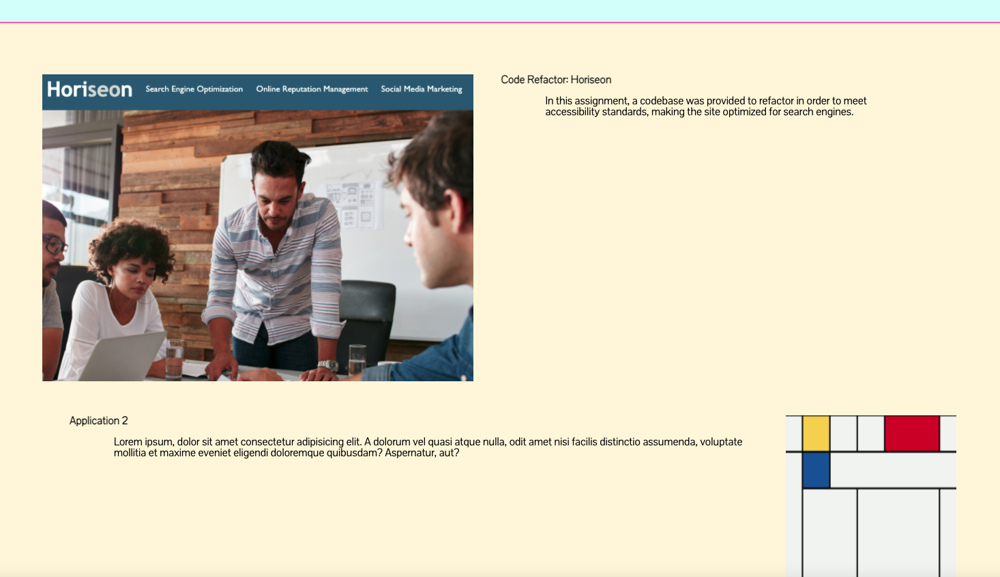

# **portfolio**

[Link to Website] {https://johnsoncm.github.io/portfolio/.}

****
****
****

The codebase was developed to present my name, a recent photo, and links to sections about my work and how to contact me.

When the user clicks the links in the navigation bar, the UI scrolls to the corresponding section.

The first application image is larger in size than the others.

When the applications are clicked, they take you to the deployed applications. For this assignment I have one deployed application, so all applications link to that site.

When the user resizes the page or views the site on various screens and devices, they are presented with a responsive layout that adapts to their viewport.

